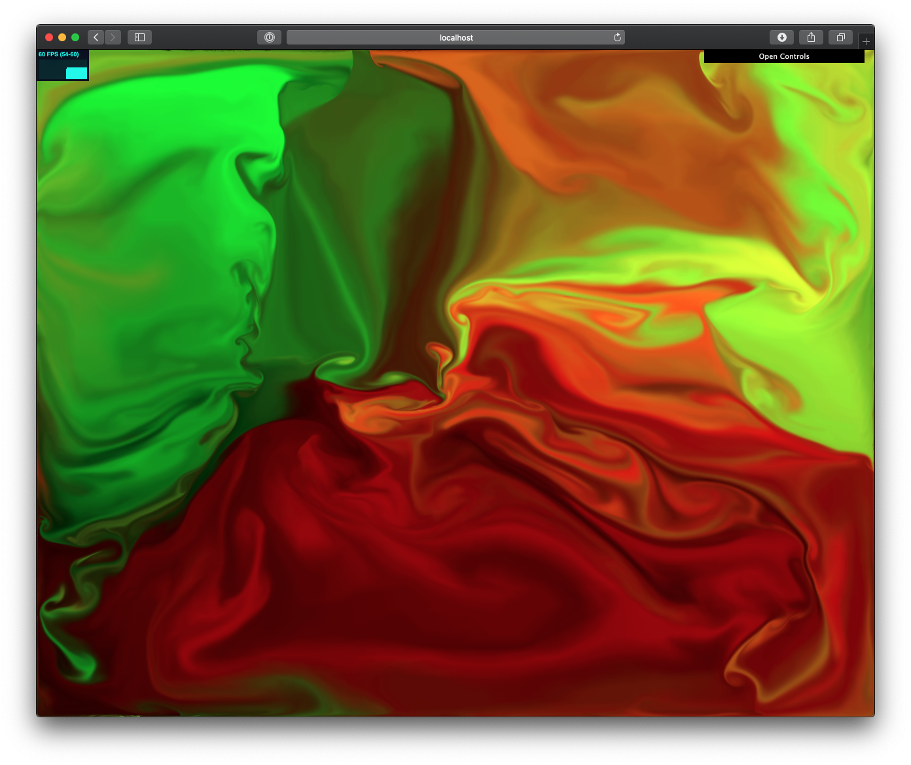

# three-fluid-sim
2D Fluid Simulation Three.js implementation.

## References
- [GPU Gems Chapter 38: Fast Fluid Dynamics Simulation on the GPU](http://developer.download.nvidia.com/books/HTML/gpugems/gpugems_ch38.html)
- [Jonas Wagner's fluidwebgl](https://github.com/jwagner/fluidwebgl)
- [Jamie Wong's article](http://jamie-wong.com/2016/08/05/webgl-fluid-simulation/)
- [Pavel Dobryakov's WebGL-Fluid-Simulation](https://github.com/PavelDoGreat/WebGL-Fluid-Simulation)

## License
The code is available under the [MIT license](LICENSE)